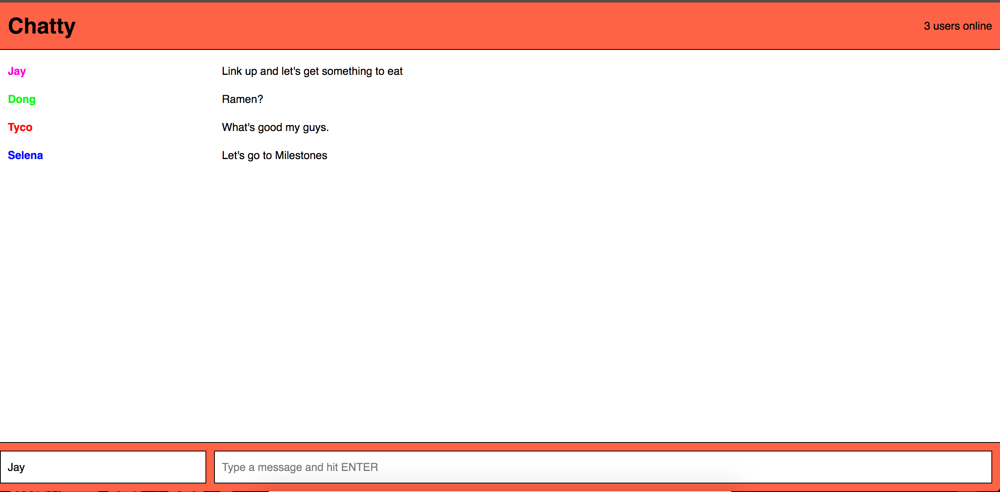

Chatty-App
=====================

An application that allows users to have live conversations. Built with React, WebSockets and Express.

### Project Screenshots


### Features
```
* Each user is able to send a chat message that is broadcast to all connected users
* When a user changes their username, all connected users are notified of the username change
* Once a new user is connected, the 'users online' counter will be incremented
* Each user will have a color associated with their username, their color stays constant even on a username change.
```

### Usage

1. Clone this repository

2. Install the dependencies and start the server.

```
npm install
npm start
open http://localhost:3000
```

### Dependencies

* React
* Webpack
* [babel-loader](https://github.com/babel/babel-loader)
* [webpack-dev-server](https://github.com/webpack/webpack-dev-server)
